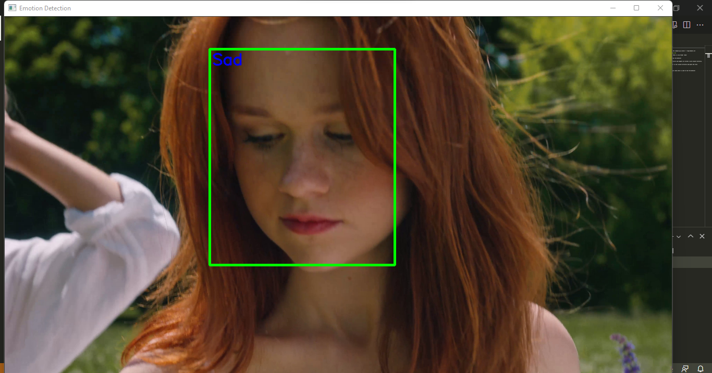

# Emotion_detection_using_CNN
## Made by Mansi Garg, Vishwa Bandita Jena, Vashali 

### Packages need to be installed
open new kernel and install requirements.txt using the command pip install -r requirements.txt

### download dataset from kaggle using the following link
- https://www.kaggle.com/msambare/fer2013
copy the test and train data from kaggle and paste them in a new folder 'data'

### Train Emotion detector
using the command python TranEmotionDetector.py, train the detector

It will take some time depending on your processor
After Training, you will find the trained model structure and weights are stored in your project directory.
- emotion_model.json
- emotion_model.h5
copy these two files and create a new 'model' folder in your project directory and paste the files

### run your emotion detection test file
using the command python TestEmotionDetector.py

### sample emotion video
in TestEmotionDetector.py,pass the path of the sample video which is used to test the detector
video is taken from Video by KoolShooters from Pexels: https://www.pexels.com/video/young-women-posing-in-the-park-on-a-windy-day-8530646/ for this project 